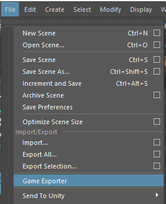

### Flipper: Create A Static Mesh

[home](../README.md#user-content-ue4-flipper) • [next](../flipper-blueprint/README.md#user-content-flipper-blueprint)

Create a new Box Brush and place it somewhere in the world. Edit the dimensions of the Brush to your liking. Our platform should be reasonably long, but should also allow the player to hop over it. For now, let's just get something to work with, as we can fix the scale later if needed.

Now convert this to a static mesh. Scroll to your Brush Settings and select “Create Static Mesh.” Name your mesh SM_Flipper, and place in the appropriate folder. Click the “Create Static Mesh” button when done.

Now we need to send this to Maya to fix the pivot point. Let's export this static mesh to Maya (because changing pivots in Unreal is very buggy). Navigate to your new static mesh in the content browser and right click it. Select Asset Actions and then hit export.

From here you can name and export your file. Place it somewhere you can find it (the desktop is fine). In your export options, deselect <b>collision</b> and <b>Level of Detail</b>. Now just hit “Export.”

Open up Maya and just drag and drop your file into the viewport. Select your mesh and enter move mode (the shortcut is W, just like in Unreal). The gizmo placed at the center is our pivot point. We want to move this so that its axis of rotation makes sense for its in-game use. In this case, the flipper should rotate starting from its back hinge.

Let’s move the mesh 150 in the X, to align it with the scene’s center.

We can move the pivot by holding D and moving the gizmo. Make sure you’re moving it in the negative X direction. Move the pivot toward the front of the mesh, so that it will rotate along that "hinge." You can test out the rotation by going into rotate mode (shortcut: E) and rotating the Y (green) axis. 

<video src="images/2021-10-12 10-09-26.mp4" width="600"></video>

https://user-images.githubusercontent.com/20305074/136996945-f1ad03b0-9596-44c1-82f3-d28b02303e83.mp4

Now that our rotational pivot makes sense, let's send this back into Unreal. With the mesh selected, go to File>Game Exporter.

Give it an appropriate name and easy-to-find path, and hit “Export.”

Let’s reimport the flipper back into the scene. Simply drag it from your file explorer into the content browser of your scene. In our export options, turn off <b>generate missing colliders</b> and <b>import textures.</b>

We’ll need to make some simple collision so that our player actually has something to land on. Double-click your static mesh in the content browser to edit its properties. Go to Collision>Add Simple Box Collision.

We’re done with the mesh for now, so now it's time to start Blueprinting.

<!-- LICENSE -->
## License
Distributed under the MIT License. See `LICENSE` for more information: [link](LICENSE).

Dev Tips

make git m="add commit message"

